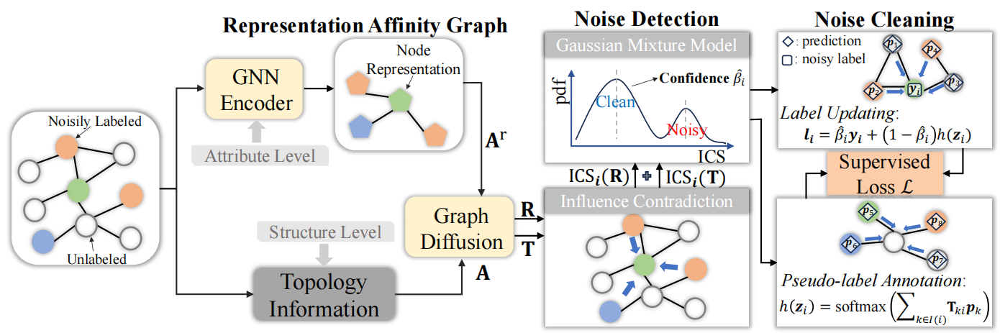

<div align="center">
  <h1>ICGNN</h1>
  <h3>Identifying and Correcting Label Noise for Robust GNNs via Influence Contradiction</h3>
  <p>
    <a href="https://github.com/wayc04/ICGNN">
      
    </a>
    <a href="https://icml.cc/Conferences/2026">
      
    </a>
    
    
  </p>
</div>

This repository contains the PyTorch implementation of:

> Wei Ju, Wei Zhang, Siyu Yi, Zhengyang Mao, Yifan Wang, Jingyang Yuan, Zhiping Xiao, Ziyue Qiao, and Ming Zhang.<br>
> **Identifying and Correcting Label Noise for Robust GNNs via Influence Contradiction.**<br>
> International Conference on Machine Learning (ICML), 2026.

## Overview

ICGNN is a robust GNN framework for semi-supervised node classification with noisy and limited labels. It introduces **Influence Contradiction Score (ICS)** to identify unreliable labels, performs soft label cleaning by neighbor aggregation, and uses pseudo-labels from unlabeled nodes as auxiliary supervision.

## Pipeline

<p align="center">
  
</p>

ICGNN detects noisy labels through structure- and attribute-level influence contradiction, then performs neighbor-aggregation-based label cleaning and pseudo-labeling for robust GNN training.

## Method

ICGNN first computes a graph diffusion matrix with Personalized PageRank:

$$
\mathbf{T} = \epsilon \left(\mathbf{I} - (1-\epsilon)\hat{\mathbf{A}}\right)^{-1}
$$

The structure-level ICS measures how strongly a labeled node is influenced by nodes annotated as other classes. To include attribute information, ICGNN also constructs a KNN-based representation affinity graph and computes an attribute-level diffusion matrix $\mathbf{R}$. The final score is:

$$
\mathrm{ICS}_i = (1-\alpha)\mathrm{ICS}_i(\mathbf{T}) + \alpha\mathrm{ICS}_i(\mathbf{R})
$$

A two-component Gaussian Mixture Model estimates the clean-label confidence $\hat{\beta}_i$ from ICS values. Then ICGNN softly updates each noisy label by combining the original annotation and neighbor-aggregated prediction:

$$
\mathbf{l}_i^{(t)} = \hat{\beta}_i^{(t)}\mathbf{y}_i + \left(1-\hat{\beta}_i^{(t)}\right)h^{(t)}(\mathbf{z}_i)
$$

The training objective uses cross-entropy on cleaned labels and pseudo-labels:

$$
\mathcal{L} = \sum_{i=1}^{L} \mathbf{l}_{i}^{(t)} \log \mathbf{p}_{i}^{(t)} + \sum_{i=L+1}^{N} h^{(t)}(\mathbf{z}_{i}) \log \mathbf{p}_{i}^{(t)}
$$

## Requirements

```text
python == 3.8
torch == 1.10.0
torch-geometric == 2.0.2
```

The training pipeline also uses `deeprobust`, `numpy`, `scipy`, `scikit-learn`, `networkx`, and `loguru`.

## Usage

Run ICGNN on Pubmed with uniform label noise:

```bash
python train.py \
--dataset pubmed \
--ptb_rate 0.2 \
--noise uniform \
--label_rate 0.01 \
--K 75 \
--local_conflict_weight 0.8 \
--warmup_epochs 30 \
--scale1 1.0 \
--temp 0.5
```

Run ICGNN on Amazon Photo with pair noise:

```bash
python train.py \
--dataset pubmed \
--ptb_rate 0.2 \
--noise pair \
--label_rate 0.01 \
--K 75 \
--local_conflict_weight 0.8 \
--warmup_epochs 30 \
--scale1 1.0 \
--temp 0.5
```

More commands are available in [`run.sh`](run.sh).

## Repository Structure

```text
ICGNN/
|-- data/          # Dataset files and cached graph artifacts
|-- models/        # GNN backbone and ICGNN implementation
|-- dataset.py     # Dataset loading and preprocessing
|-- train.py       # Main training script
|-- utils.py       # Noise generation, ICS utilities, and metrics
`-- run.sh         # Reproduction commands
```

## Acknowledgements

We thank NRGNN for releasing its open-source code, which provided a valuable reference for this repository.

## Citation

If this work is useful for your research, please cite:

```bibtex

```
